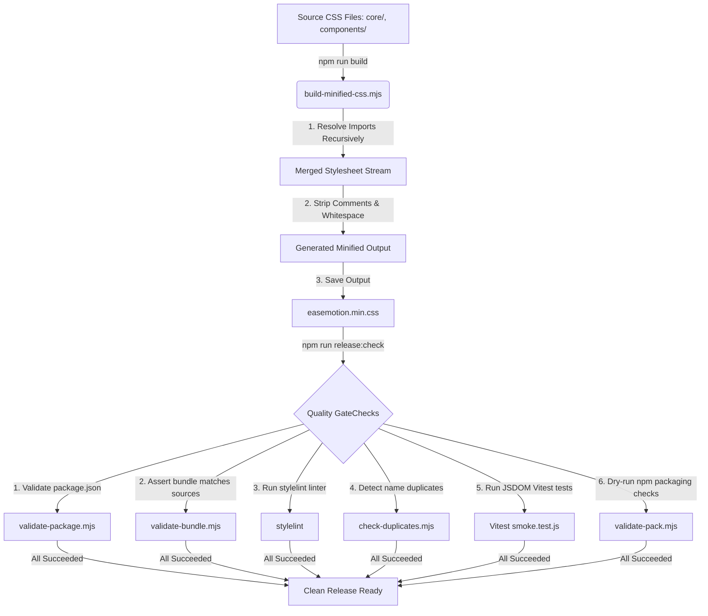

# 📚 EaseMotion CSS — Codebase Architecture & Maintainer Guide

This documentation serves as a comprehensive reference guide for the architecture, build pipeline, contribution policies, automation systems, and release procedures of **EaseMotion CSS**. 

---

## 1. Repository Overview

### What is EaseMotion CSS?
EaseMotion CSS is a human-readable, animation-first, zero-dependency CSS utility and component framework. Its core philosophy is simple: **"If you can say it in English, you should be able to write it as a class name."**

### Architectural Blueprint
The framework is designed around three main layers:
1. **Design Tokens (`core/variables.css`):** The foundational colors, scales, spacing, and transition speeds.
2. **Animation Engine (`core/animations.css`):** Composable `@keyframes` and class utilities that power hardware-accelerated motion.
3. **UI Components (`components/`):** Pre-styled, modular elements (buttons, cards, sidebars, tabs, tooltips, modals) that leverage the design tokens.

The repository follows a **"curated sandbox model"**. All community contributions are strictly confined to sandbox directories inside `submissions/examples/`. The maintainer standardizes, refactors, and merges these contributions into the core files, ensuring that the codebase remains clean, conflict-free, and conforms to production-grade quality standards.

```
                  ┌─────────────────────────────────────┐
                  │        submissions/examples/        │  ◄── Contributors submit here
                  └──────────────────┬──────────────────┘
                                     │ (Maintainer Curates)
                                     ▼
┌────────────────────────────────────────────────────────────────────────┐
│                        CORE FRAMEWORK SOURCE CODE                      │
├──────────────────┬──────────────────┬────────────────┬─────────────────┤
│      core/       │   components/    │  easemotion/   │  easemotion.css │
│ (Animations/Var) │ (UI Components)  │ (Modular/Ticker)│  (Entry Point)  │
└──────────────────┴──────────────────┴────────────────┴────────┬────────┘
                                                                 │
                                                                 ▼ (npm run build)
                                                      ┌──────────────────┐
                                                      │easemotion.min.css│  ◄── Compiled release bundle
                                                      └──────────────────┘
```

---

## 2. Folder-by-Folder Breakdown

| Directory Path | Description / Contents | Edit Policy for Contributors | Risk Level |
|:---|:---|:---|:---|
| [`.github/`](file:///d:/DESKTOP/EaseMotion-css/.github) | Contains GitHub Actions workflows for CI/CD linting, validation, benchmarks, and issue responders. | **DO NOT EDIT.** Maintained by repo owners. Modifying this can break automated build checks. | 🔴 **High Risk** |
| [`core/`](file:///d:/DESKTOP/EaseMotion-css/core) | Foundations of the framework: CSS variables, layout utilities, CSS resets, and the animation engine. | **FREEZE.** No direct PR edits allowed. Only modified during curate-merges. | 🔴 **High Risk** |
| [`components/`](file:///d:/DESKTOP/EaseMotion-css/components) | Standardized, ready-to-use UI components (e.g. tabs, loaders, tooltips, modals). | **FREEZE.** No direct PR edits allowed. | 🔴 **High Risk** |
| [`easemotion/`](file:///d:/DESKTOP/EaseMotion-css/easemotion) | Contains self-contained, modular stylesheets for granular CDN loading (Option 4) and marquee. | **FREEZE.** No direct PR edits allowed. | 🔴 **High Risk** |
| [`scripts/`](file:///d:/DESKTOP/EaseMotion-css/scripts) | Validation, compilation, conflict resolution, and contributor wall updating scripts. | **DO NOT EDIT.** Custom Node.js/Python scripts governing CI validations. | 🔴 **High Risk** |
| [`tests/`](file:///d:/DESKTOP/EaseMotion-css/tests) | JSDOM smoke tests written in Vitest to verify core CSS properties and minification results. | **DO NOT EDIT.** Used exclusively to verify release builds. | 🟡 **Medium Risk** |
| [`docs/`](file:///d:/DESKTOP/EaseMotion-css/docs) | Codebase for the documentation website deployed to GitHub Pages. | **MODERATE.** Allowed if fixing typos or documentation bugs. | 🟡 **Medium Risk** |
| [`submissions/`](file:///d:/DESKTOP/EaseMotion-css/submissions) | Folder structure containing example templates, documentation pages, and community sandboxes. | **SAFE.** This is the primary directory where contributors work. | 🟢 **Safe** |
| [`submissions/examples/`](file:///d:/DESKTOP/EaseMotion-css/submissions/examples) | Over 500 isolated folders containing standalone html/css demos from community contributors. | **SAFE.** All community PRs must create a new folder here. | 🟢 **Safe** |

---

## 3. File-by-File Explanation

### Entry Points & Bundles
*   **[`easemotion.css`](file:///d:/DESKTOP/EaseMotion-css/easemotion.css) (Source):** The single uncompiled entry point. It imports all of `core/`, `components/`, and `easemotion/ease-marquee.css` in cascade-logical order. Modification breaks the entire framework compilation sequence.
*   **[`easemotion.min.css`](file:///d:/DESKTOP/EaseMotion-css/easemotion.min.css) (Generated):** The minified distribution bundle. Generated automatically by `npm run build`. **NEVER edit this file manually.** Doing so violates bundle integrity checks and creates merge conflict locks.
*   **[`easemotion/all.css`](file:///d:/DESKTOP/EaseMotion-css/easemotion/all.css) (Source):** The unminified modular bundle entry point. It imports modular stylesheets and core variables, allowing developers to import a modular subset of animations.

### Foundational Core Code
*   **[`core/variables.css`](file:///d:/DESKTOP/EaseMotion-css/core/variables.css) (Source):** Design tokens (colors, animations easings, sizing). All other components depend on the custom properties declared in this file.
*   **[`core/base.css`](file:///d:/DESKTOP/EaseMotion-css/core/base.css) (Source):** Browser stylesheet resets and default font assignments.
*   **[`core/animations.css`](file:///d:/DESKTOP/EaseMotion-css/core/animations.css) (Source):** The animation engine. Contains all core `@keyframes` and mapped classes.
*   **[`core/utilities.css`](file:///d:/DESKTOP/EaseMotion-css/core/utilities.css) (Source):** Flexbox, grid, sizing, margin, and padding layout classes.
*   **[`core/reveal.js`](file:///d:/DESKTOP/EaseMotion-css/core/reveal.js) (Source):** Vanilla JS helper script that adds an `.active` class to items when they intersect the viewport (scroll reveal animations).

### Build & Release Verification Scripts
*   **[`scripts/build-minified-css.mjs`](file:///d:/DESKTOP/EaseMotion-css/scripts/build-minified-css.mjs):** Resolves `@import` statements recursively, removes code comments, strips whitespace, and outputs the minified `easemotion.min.css`.
*   **[`scripts/resolve-conflict.mjs`](file:///d:/DESKTOP/EaseMotion-css/scripts/resolve-conflict.mjs):** Automated helper to clear Git conflict markers on the minified CSS. It compiles a fresh bundle from the merged source branches and stages the file automatically.
*   **[`scripts/check-duplicates.mjs`](file:///d:/DESKTOP/EaseMotion-css/scripts/check-duplicates.mjs):** Scans files in `core/` and `components/` to verify that no class name or keyframe name has been declared twice.
*   **[`scripts/validate-package.mjs`](file:///d:/DESKTOP/EaseMotion-css/scripts/validate-package.mjs):** Asserts that `package.json` contains mandatory release script configurations and required files.
*   **[`scripts/validate-bundle.mjs`](file:///d:/DESKTOP/EaseMotion-css/scripts/validate-bundle.mjs):** Compiles sources locally and compares the MD5 hash against the committed `easemotion.min.css` to verify that the maintainer rebuilt the bundle before pushing.
*   **[`scripts/validate-pack.mjs`](file:///d:/DESKTOP/EaseMotion-css/scripts/validate-pack.mjs):** Performs a dry-run package packing (`npm pack`) and inspects the tarball content list to verify all essential files are present and no temporary files are packaged.

### Configurations
*   **[`package.json`](file:///d:/DESKTOP/EaseMotion-css/package.json):** Configuration file defining scripts, dependencies, main entry points, and packaged files. Adding `"easemotion/"` to the `"files"` array ensures the modular animations are packaged.
*   **[`.gitattributes`](file:///d:/DESKTOP/EaseMotion-css/.gitattributes):** Marks `easemotion.min.css` as binary (`-diff -merge`) to prevent git from generating text merge conflict markers, eliminating pull request blockers.

---

## 4. CSS Architecture

### 1. Naming Conventions

#### Class Names
All utility and component classes are prefixed with `ease-` to protect them from stylesheet collisions.
*   *Format:* `ease-[component]-[modifier]` or `ease-[utility]-[value]`
*   *Examples:* `.ease-btn-primary`, `.ease-card-sm`, `.ease-flex-col`, `.ease-center`

#### Animation Keyframes
Keyframes must follow the prefix convention: `ease-kf-[animation-name]`.
*   *Format:* `ease-kf-[animation-name]`
*   *Examples:* `@keyframes ease-kf-fade-in`, `@keyframes ease-kf-wave`

```css
/* Standardized animation class definition */
.ease-wave {
  display: inline-block;
  animation: ease-kf-wave 2s ease-in-out var(--ease-animation-iterations, infinite);
}
```

### 2. Cascade Layers Strategy
EaseMotion CSS organizes styles using native CSS Cascade Layers via the `@layer` statement. This ensures that utility classes can be overridden by component classes, and custom code can override both, regardless of selector specificity:

```css
/* Declared at the top of easemotion.css */
@layer easemotion-utilities, easemotion-components;

/* utility class is layered */
@layer easemotion-utilities {
  .ease-d-block { display: block !important; }
}

/* component class is layered */
@layer easemotion-components {
  .ease-btn { padding: 0.5rem; display: inline-flex; }
}
```
*Note: `core/variables.css` and `core/base.css` are intentionally left unlayered so that design token definitions and global resets are applied globally at the root cascade level.*

---

## 5. Build Pipeline

The compilation and validation pipeline ensures that the release stylesheet is minified, linted, test-proven, and packaged correctly without polluting the repository with stale files.

### Compilation and Linting Flowchart



### Validation Quality Gates
When running the pre-release script (`npm run release:check`), the following pipeline commands execute sequentially:
1.  **`validate:manifest`**: Checks `package.json` formatting and values.
2.  **`validate:bundle`**: Recompiles the source CSS files and checks the MD5 signature against the committed `easemotion.min.css` to verify that the build is not stale.
3.  **`build`**: Re-generates `easemotion.min.css`.
4.  **`lint`**: Stylelint scans CSS rules for formatting violations.
5.  **`lint:duplicates`**: Inspects files to block duplicate keyframe or class definitions.
6.  **`test`**: Runs JSDOM smoke tests to verify styles in simulated browser DOM environments.
7.  **`validate:pack`**: Dry-packs the npm tarball and audits the files to prevent shipping test configs or missing files.

---

## 6. Contributor Workflow

EaseMotion CSS uses a curated repository isolation strategy to remain highly scalable during massive open-source events (like GSSoC) without resulting in merge conflict blocks on core bundles.

### Accepted Workflow
1.  **Create Sandbox Folder:** The contributor creates a new folder inside `submissions/examples/`.
    *   *Naming Convention:* `submissions/examples/[feature-abbreviation-id]/` (e.g. `submissions/examples/ease-hover-sap/`).
2.  **Add Mandatory Files:** The folder must contain exactly:
    *   `README.md` (Explaining usage, variables, and features)
    *   `demo.html` (An interactive sandbox demonstration of the component)
    *   `style.css` (The style sheet for the example)
3.  **Verify Casing:** Ensure folder name matches the file references (to avoid case-sensitivity failures on Linux runners).
4.  **Submit Pull Request:** Submit the PR. Since the PR only modifies `submissions/examples/`, CI ignores bundle verification, preventing conflicts.

### Rejected Workflow (Will be automatically blocked or rejected)
*   **Modifying Core Files directly:** Modifying `core/`, `components/`, or `easemotion.css` directly in a community PR.
*   **Modifying compiled artifacts:** Committing manual changes inside `easemotion.min.css`.
*   **No Unique Suffix:** Creating component classes without unique suffixes, causing namespace collisions.

### Curation Pipeline for Maintainers
When a sandbox submission is ready to be promoted into the core framework:
```
1. Maintainer reviews sandbox styles (style.css)
        │
        ▼ (Refactor and Standardize)
2. Rename classes to 'ease-[name]' and keyframes to 'ease-kf-[name]'
        │
        ▼ (Integration)
3. Move keyframes to core/animations.css
4. Move component styles to a new file in components/ (e.g., components/tooltips.css)
        │
        ▼ (Verification)
5. Register import in easemotion.css & easemotion/all.css
6. Run 'npm run release:check' to generate a fresh minified bundle
7. Commit, push, and close the issue.
```

---

## 7. Automation & Bots

GitHub Action workflows automate quality control checks on every push and pull request.

| Workflow File | Event Trigger | Purpose | Risks & Safeguards | Recommended Improvement |
|:---|:---|:---|:---|:---|
| [`ci.yml`](file:///d:/DESKTOP/EaseMotion-css/.github/workflows/ci.yml) | `pull_request` on core paths | Runs HTMLHint and Stylelint across changed files. | **Risk:** Can block PRs on deleted files.<br>**Safeguard:** Pinned linter versions and file existence checks. | Add automated lint-fixing commit triggers. |
| [`test.yml`](file:///d:/DESKTOP/EaseMotion-css/.github/workflows/test.yml) | `pull_request` on all paths | Installs dependencies and runs Vitest smoke tests. | **Risk:** Slow execution times.<br>**Safeguard:** Skipped for documentation-only changes. | Cache `node_modules` folders. |
| [`submission-validator.yml`](file:///d:/DESKTOP/EaseMotion-css/.github/workflows/submission-validator.yml) | `pull_request_target` | Validates sandbox folder structures and file casing. | **Risk:** Fork PR access limits.<br>**Safeguard:** Runs under `pull_request_target` to allow write checks safely. | Generate automated review comments on validation failures. |
| [`css-size-benchmark.yml`](file:///d:/DESKTOP/EaseMotion-css/.github/workflows/css-size-benchmark.yml) | `pull_request_target` | Compiles the branch, benchmarks raw/gzipped/brotli size vs main, and prints comparison table in PR comment. | **Risk:** Security exploits on forks.<br>**Safeguard:** Executes in a read-only environment without checking out secret keys. | None. This is highly optimized. |
| [`update-contributor-wall.yml`](file:///d:/DESKTOP/EaseMotion-css/.github/workflows/update-contributor-wall.yml) | Daily Cron Job | Fetches GitHub contributors list and updates `README.md` wall grid. | **Risk:** Commit conflict loop.<br>**Safeguard:** Scheduled daily and off-push to prevent workflow commit collision. | Trigger wall rebuilding only on merged pull requests. |

---

## 8. ⚠ DO NOT EDIT DIRECTLY

The following files are **build artifacts** generated automatically. Manual modification is strictly forbidden:

### `easemotion.min.css`
*   **Why:** This file is generated by `scripts/build-minified-css.mjs`.
*   **Consequences of direct editing:** 
    1. Your changes will be overwritten on the next compile execution.
    2. The hash verification check (`validate-bundle.mjs`) will fail, blocking deployment.
    3. You will generate merge conflict blocks for other developers.
*   **How to resolve git conflicts:** If git highlights a conflict on this file during merge or rebase, simply run:
    ```bash
    npm run resolve-conflict
    ```

---

## 9. Dependency Graph

The diagram below represents the compilation dependency flow:

```
[core/variables.css] (Global Custom Properties)
       │
       ├──────────────────────────────┐
       ▼                              ▼
[core/base.css]               [easemotion/ease-marquee.css]
       │                              │
       ▼                              ▼
[core/animations.css]                 │
       │                              │
       ▼                              ▼
[core/utilities.css] ─────────────────┤
       │                              │
       ▼                              ▼
[components/*.css] (buttons, cards, sidebars, tooltips, modals)
       │                              │
       ├──────────────────────────────┘
       ▼
[easemotion.css] (Entry Point)
       │
       ▼ (npm run build)
[easemotion.min.css] (Minified Distribution Output)
```

---

## 10. Maintainer Notes

### Conflict Prevention Strategy
With hundreds of contributors, conflicts on `easemotion.min.css` are highly likely. To completely prevent them:
1.  **Binary Attribute Mapping:** `.gitattributes` treats `easemotion.min.css` as binary (`-diff -merge`), preventing Git from injecting inline conflict text markers.
2.  **CI Validation Bypass:** `scripts/validate-bundle.mjs` runs `git diff` to check if a PR only modifies sandbox examples (`submissions/examples/*`). If it is example-only, it bypasses the bundle checks entirely.
3.  **Conflict Resolver:** In case of local conflict, use `npm run resolve-conflict`.

### Review Discipline
*   Verify that any new core animation has a fallback declaration in the prefers-reduced-motion block in `core/animations.css`.
*   Ensure that any new component class is layered using `@layer easemotion-components`.
*   Confirm that `npm run release:check` completes successfully before merging any pull request.

---

## Quick Reference Guides

### ⚡ Quick Start for Maintainers
To prepare a new release:
1.  Standardize and move any chosen sandbox components into the `components/` or `core/` directory.
2.  Run the build and release validation command locally:
    ```bash
    npm run release:check
    ```
3.  If any file conflicts occur on the minified bundle, resolve them using:
    ```bash
    npm run resolve-conflict
    ```
4.  Commit the changes and push to `main`. CI will automatically run the size benchmarks, smoke tests, and upload the build assets.

### 🛡 Safe Contribution Guide
1.  Choose a feature or layout you want to build.
2.  Create your sandbox folder: `submissions/examples/ease-[feature]-[your-initials]/`.
3.  Add exactly three files: `README.md`, `demo.html`, and `style.css`.
4.  Add unique suffixes to your classes (e.g. `.ease-tabs-ak`) to avoid collisions.
5.  Do not edit any files in `core/`, `components/`, or the root directory.
6.  Submit your Pull Request. It will pass validations instantly!

### 🧱 Core Architecture Summary
*   **Variables:** `core/variables.css`
*   **Reset Styles:** `core/base.css`
*   **Animation Utilities:** `core/animations.css`
*   **Layout Utilities:** `core/utilities.css`
*   **Entry Point:** `easemotion.css` (Bundles to `easemotion.min.css`)
*   **Component Layers:** Standardized UI styles located in the `components/` directory, imported globally under the `@layer easemotion-components` cascade block.
